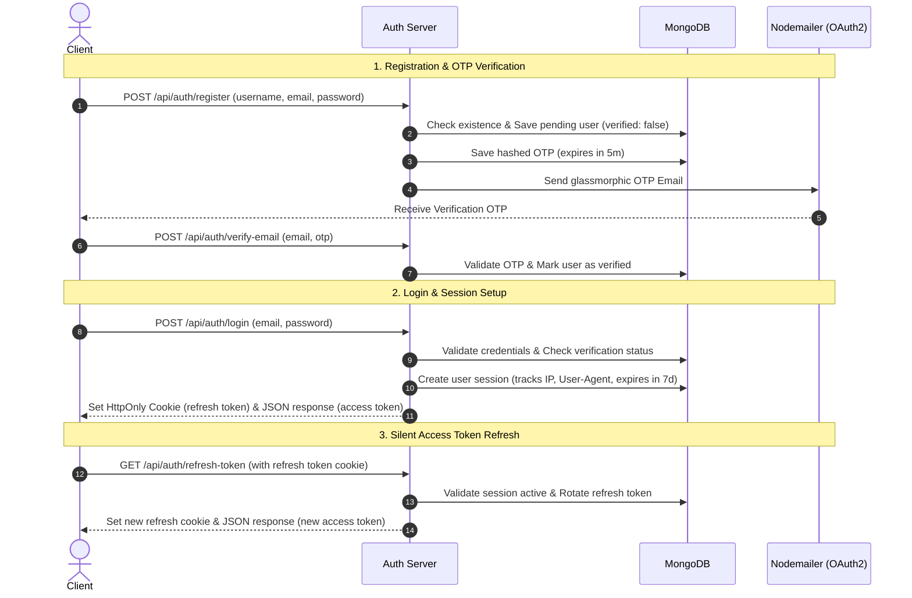

# Secure Auth System

A highly secure, production-ready User Authentication and Session Management API built with **Node.js**, **Express**, and **MongoDB**. 

This system features complete email-verified registration (using Google OAuth2 & Nodemailer), secure JWT-based access/refresh token rotation, multi-device session tracking, and a global logout functionality.

---

## Architecture & Authentication Flow



---

## Features

- 🔐 **Secure Password Hashing**: Passwords are securely hashed using `SHA-256` before database insertion.
- ✉️ **OTP Email Verification**: Glassmorphic HTML verification emails sent using Google OAuth2 integration with `Nodemailer`.
- 🕒 **Auto-Expiring OTPs**: OTP entries are automatically removed from MongoDB after 5 minutes using native TTL indices.
- 🔄 **JWT Access & Refresh Token Rotation**:
  - Short-lived Access Tokens (15 minutes) passed in authorization headers.
  - Long-lived Refresh Tokens (7 days) stored in secure, `HttpOnly`, `Secure`, `SameSite=Strict` cookies.
  - Automatic database-backed session synchronization to prevent replay attacks.
- 🖥️ **Session Tracking**: Tracks client IP address, browser User-Agent strings, and creation/expiration timestamps.
- 🔌 **Multi-Device Logout**:
  - Local Logout: Revokes the current session and clears cookies.
  - Global Logout (`logout-all`): Revokes all active sessions across all devices for the user.

---

## Folder Structure

```
├── server.js                 # App server entry point
└── src
    ├── app.js                # Express app setup and middleware
    ├── config
    │   ├── config.js         # Configuration parser and env validation
    │   └── database.js       # MongoDB database connection configuration
    ├── controllers
    │   └── auth.controller.js # Logic for login, signup, verification, and logout
    ├── middlewares
    │   └── auth.middleware.js # Express middleware for JWT access and refresh token validation
    ├── models
    │   ├── otp.model.js      # Schema for temporal OTP storage
    │   ├── session.model.js  # Schema for tracking active sessions
    │   └── user.model.js     # Schema for user records
    ├── routes
    │   └── auth.routes.js    # Authentication API endpoint routes
    ├── services
    │   └── email.service.js  # Nodemailer configuration and email triggers
    └── utils
        └── utils.js          # Cryptographic OTP gen & email layouts
```

---

## Setup & Installation

### 1. Clone the repository
```bash
git clone <repository-url>
cd Auth-System
```

### 2. Install dependencies
```bash
npm install
```

### 3. Environment Variables Configuration
Create a `.env` file in the root directory based on the `example.env` file:
```env
MONGO_URI=your-mongodb-connection-string
JWT_SECRET=your-jwt-signing-secret

# Google OAuth2 Credentials for Nodemailer (Gmail)
GOOGLE_CLIENT_ID=your-google-client-id
GOOGLE_CLIENT_SECRET=your-google-client-secret
GOOGLE_REFRESH_TOKEN=your-google-oauth2-refresh-token
GOOGLE_USER=your-verified-gmail-address
```

### 4. Running the Server

#### Development Mode (nodemon auto-reloads)
```bash
npm run dev
```

#### Production Mode
```bash
npm start
```

---

## API Endpoints

### Authentication Group (`/api/auth`)

| Method | Endpoint | Request Body / Cookies | Description | Access Control |
| :--- | :--- | :--- | :--- | :--- |
| **POST** | `/register` | `{ username, email, password }` | Register a new user and trigger verification OTP. | Public |
| **POST** | `/verify-email` | `{ email, otp }` | Verify OTP code and activate the user account. | Public |
| **POST** | `/login` | `{ email, password }` | Authenticate credentials. Creates session, returns Access Token, and sets Refresh Token cookie. | Public |
| **GET** | `/get-me` | *Authorization Header (Bearer token)* | Retrieve the active user's details. | Protected (`requireAccessToken` middleware) |
| **GET** | `/refresh-token` | *Refresh Token Cookie* | Validate session and issue a new pair of Access & Refresh tokens. | Protected (`requireRefreshToken` middleware) |
| **GET** | `/logout` | *Refresh Token Cookie* | Revokes current session and clears the Refresh Token cookie. | Protected (`requireRefreshToken` middleware) |
| **GET** | `/logout-all` | *Refresh Token Cookie* | Revokes all active sessions across all devices for the user. | Protected (`requireRefreshToken` middleware) |

---

## Security Practices Implemented

1. **HttpOnly Cookies**: Refresh tokens are inaccessible to client-side scripts, completely mitigating XSS-based token theft.
2. **Refresh Token Rotation**: Each time a session is refreshed, a new refresh token is generated, minimizing the window of opportunity for intercepted tokens.
3. **Session Revocation**: A session is stateful on the database side; it can be marked as revoked at any time, allowing instant session validation.
4. **Environment Constraints**: Server-wide configuration checking is executed at startup, preventing execution if any security parameters are missing.
